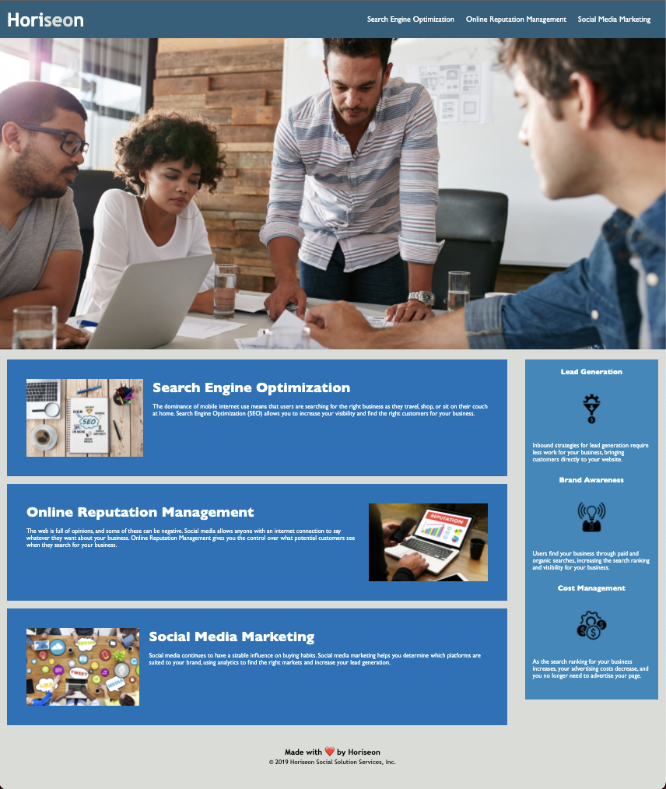

# semantic-markup

#Project Description:

Initial task was to update page to ensure accessibility standards are met so that people with disabilities can access the site using assistive technologies like video captions, screen readers and braille keyboards. Additional accessibility updates may provide site with higher ranking with search engines like Google.

#HTML Changes: 

-Added comments to index.html to facilitate refactoring.
-Corrected broken link on search engine optimization nav.
-Title changed to company name (Horiseon). 
-Added elements for header, footer, nav, main, aside, articles, and figure for main image, 
-Added Alts to images.

#CSS Changes: 

-Added comments to style.css to facilitate refactoring.
-Consolidated repatative styles. 
-Re-identified style selectors accordingly.

#Deployment link to finished site: 

https://crumwj22.github.io/semantic-markup/

#Contributions:

-Code rafactoring completed by Jesse Crumley